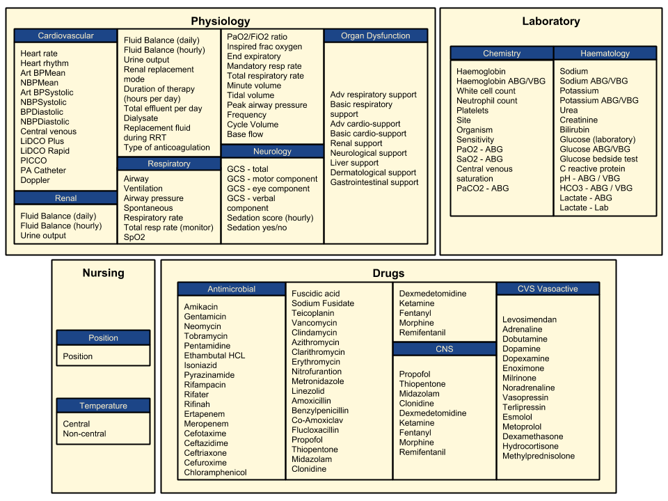
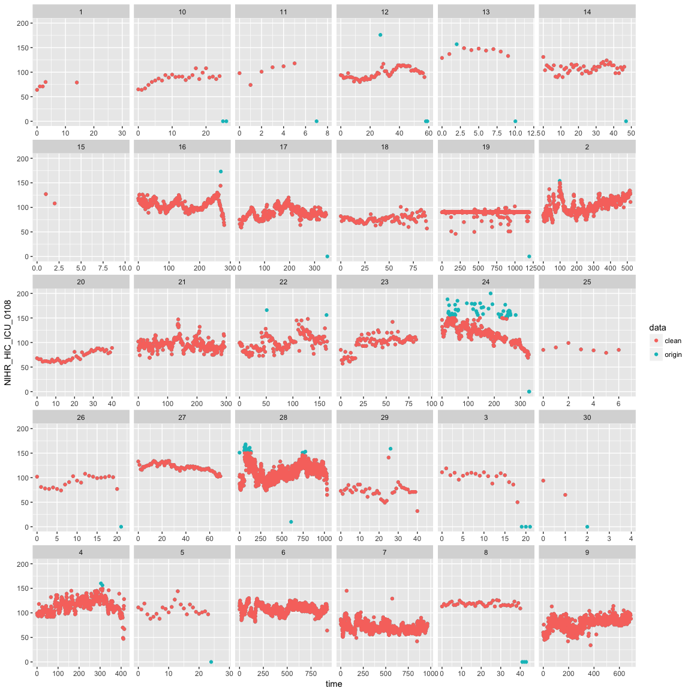

# Summary

cleanEHR [@cleanEHR] is a data cleaning and wrangling platform which works with
the Critical Care Health Informatics Collaborative (CCHIC) database.  CCHIC
collects and gathers high resolution longitudinal patient record from critical
care units at Cambridge, Guys/Kings/St Thomas', Imperial, Oxford, UCL
Hospitals. 

The increased adoption of high resolution longitudinal EHRs has created novel
opportunities for researchers, clinicians and data scientists to access large,
enriched patient databases [@icnarc] [@mimic]. The purpose of cleanEHR is to
enable researchers to answer clinical questions that are important to patients.
cleanEHR is a solution to address various data reliability and accessibility
problems as well. It provides a platform that enables data manipulation,
transformation, reduction, cleaning and validation with a friendly user
interface which empowers non-programmers to conduct basic data analysis by
simply writing a human-readable configuration file.

# High resolution longitudinal EHR: CCHIC

CCHIC database has in total collected 22,628 admissions (18,074 unique
patients) from 2014 to 2017. It contains 119 million data points (mean 6626
data points per patient). The recruited patients have an age range from 18 to
116 years old. Physiological, laboratory, drugs and nursing information are the
longitudinal data recorded during a patient's stay of the ICU.  The full list
of longitudinal data collected by CCHIC is listed below.

# Data cleaning and wrangling

Data of this kind, though provides vast information, often faces two
main issues, a) low data quality, b) low accessibility due to the complexity.
We proposed a workflow, which has been incorporated in the cleanEHR package, to address
the these issues. The highlight of this workflow includes the following,

* A table structure (ccTable) for data manipulation.
* Configuration file for researchers without technical knowledge to select and clean 
the data. The data cleaning includes various filters and data interpolation (impute)
function.

For detail description of the functions and examples, please see the manual and
the vignettes of cleanEHR [@cleanEHR]

# Reference
